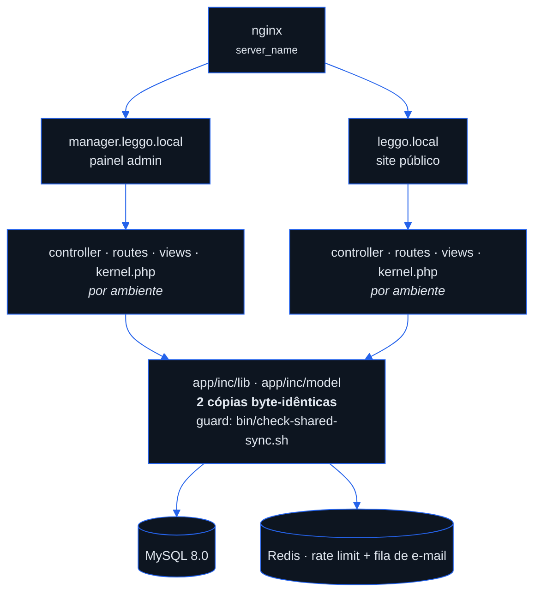
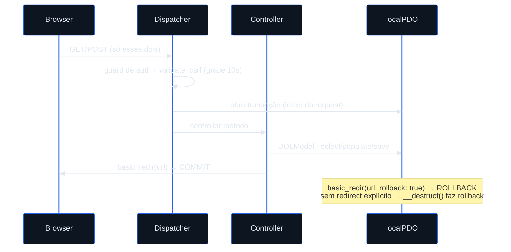

<p align="center">
  <picture>
    <source media="(prefers-color-scheme: dark)" srcset=".github/assets/banner-dark.svg">
    
  </picture>
</p>

<h1 align="center">LEGGO</h1>
<p align="center">Starter whitelabel em PHP 8.4 sobre framework próprio — dois ambientes, um único codebase, pronto para clonar e rebrandar.</p>

<p align="center">
  <a href="https://github.com/cehdoliveira/leggo/actions/workflows/ci.yml"></a>
  
  
  
  
</p>

- [Setup rápido](#setup-rápido)
- [Arquitetura](#arquitetura)
- [Estrutura do repositório](#estrutura-do-repositório)
- [Comandos](#comandos)
- [Framework LEGGO](#framework-leggo)
- [Personalização (whitelabel)](#personalização-whitelabel)
- [Segurança](#segurança)
- [Documentação](#documentação)

## Setup rápido

```bash
# 1. Clone
git clone <repo-url> meu-projeto && cd meu-projeto

# 2. Copie as configs (gitignored — nunca commite credenciais)
cp manager/app/inc/kernel.php.example manager/app/inc/kernel.php
cp site/app/inc/kernel.php.example site/app/inc/kernel.php

# 3. Adicione os hosts locais
echo "127.0.0.1 leggo.local manager.leggo.local" | sudo tee -a /etc/hosts

# 4. Suba os containers
docker compose -f docker/docker-compose.yml up -d --build

# 5. Rode as migrations e ative a senha do admin (nasce desabilitado, sem senha usável)
docker exec leggo php /var/www/leggo/site/cgi-bin/run_migrations.php
echo 'sua-senha' | docker exec -i leggo php /var/www/leggo/manager/cgi-bin/set_admin_password.php

# 6. Habilite os hooks (pre-commit: PHPStan + shared-sync; pre-push: PHPUnit)
git config core.hooksPath .githooks

# 7. Acesse
# Manager:  http://manager.leggo.local
# Site:     http://leggo.local
```

> [!IMPORTANT]
> O nginx roteia os dois ambientes por `server_name`
> (`docker/interface/default.conf`). Sem essas entradas no `/etc/hosts`,
> `leggo.local` e `manager.leggo.local` não resolvem.

## Arquitetura



`manager` e `site` compartilham o mesmo `app/inc/lib` e `app/inc/model` —
duas cópias byte-idênticas verificadas pelo guard `bin/check-shared-sync.sh`
no pre-commit. Controllers, rotas, views e `kernel.php` são por ambiente e
podem divergir. Redis é **fail-open**: se ficar indisponível, a
request continua (rate limit e e-mail assíncrono degradam, não derrubam).



<details>
<summary>Rotas do site e do manager</summary>

### Site (`leggo.local`)
| Método | Rota | Auth |
|--------|------|------|
| GET | `/` | Auto |
| GET/POST | `/login` | Não |
| GET/POST | `/cadastro` | Não |
| GET | `/verificar-email/{token}` | Não |
| GET/POST | `/definir-senha/{token}` | Não |
| GET/POST | `/esqueci-minha-senha` | Não |
| GET/POST | `/redefinir-senha/{token}` | Não |
| POST | `/sair` | Não |
| GET | `/area` | Sim |
| GET | `/termos-de-uso` | Não |
| GET | `/politica-de-privacidade` | Não |

### Manager (`manager.leggo.local`)
| Método | Rota | Auth |
|--------|------|------|
| GET | `/`, `/admin` | Sim |
| GET/POST | `/login` | Não |
| POST | `/sair` | Não |
| GET/POST | `/cadastro` | Sim |
| GET/POST | `/definir-senha/{token}` | Não |
| GET/POST | `/usuarios` | Sim |
| GET | `/emails` | Sim |
| GET/POST | `/perfis` | Sim |

</details>

## Estrutura do repositório

```
manager/               ← Painel admin (manager.leggo.local)
  app/inc/
    controller/        ← Lógica das rotas
    lib/               ← Framework LEGGO (Dispatcher, ORM, PDO, Redis, fila de e-mail, Logger)
    model/             ← Models (users, profiles, messages)
    kernel.php         ← Config sensível (gitignored, copiar do .example)
  public_html/         ← Raiz web
  tests/               ← Testes PHPUnit
  phpstan.neon         ← PHPStan config (level 4)

site/                  ← Site público (leggo.local)
  app/inc/             ← Mesma estrutura do manager
  public_html/         ← Raiz web
  tests/               ← Testes PHPUnit

migrations/            ← Migrations SQL (compartilhadas) — atômicas (transaction por arquivo)
docker/                ← Dockerfile, nginx, php.ini, entrypoint, .env.example
bin/                   ← check-shared-sync.sh (guard de sincronia lib/model, roda no pre-commit)
                          test.sh (verificação completa: PHPStan host + PHPUnit Docker, 2 envs)
                          init-whitelabel.sh (gera os 2 kernel.php para uma marca nova)
.github/workflows/     ← CI: sync-guard + PHPStan + PHPUnit (MySQL de serviço)
.githooks/             ← pre-commit (PHPStan) + pre-push (PHPUnit)
.editorconfig          ← Estilo de código
plans/                 ← Planos de implementação do advisor (31 planos, índice em plans/README.md)
```

## Comandos

CI (GitHub Actions) roda sync-guard + PHPStan + PHPUnit (com MySQL de serviço) em todo push/PR.

| Objetivo | Comando | Onde roda |
|---|---|---|
| Verificação completa (PHPStan host + PHPUnit Docker, 2 envs) | `bin/test.sh` | raiz do repo |
| Análise estática — PHPStan nível 4 | `php app/inc/lib/vendor/bin/phpstan analyse` | `manager/` e `site/` |
| Testes | `php app/inc/lib/vendor/bin/phpunit` | `manager/` e `site/` |
| Teste único | `php app/inc/lib/vendor/bin/phpunit --filter testMethodName` | `manager/` ou `site/` |
| Migrations manuais (roda automático a cada 5 min) | `docker exec leggo php /var/www/leggo/site/cgi-bin/run_migrations.php` | host |
| Acessar MySQL | `docker exec -it mysql mysql -u user_leggo -p db_leggo` | host |
| Acessar Redis | `docker exec -it redis redis-cli` | host |
| Rebuild após mudanças no Dockerfile | `docker compose -f docker/docker-compose.yml up -d --build` | host |

> [!NOTE]
> Ao bumpar `VERSION`, atualize também `APP_VERSION` nos dois
> `kernel.php.example` (usado no cache-bust de assets `?v=` em `foot.php`).

## Framework LEGGO

Projeto roda sobre framework próprio (não Laravel/Symfony).

| Componente | Arquivo | Função |
|-----------|---------|--------|
| Router | `Dispatcher.php` | `add_route(METHOD, pattern, "controller:method", guard, args)` |
| ORM | `DOLModel.php` | Active record com soft-delete, `populate()`/`save()`/`remove()`, `select()`/`update()` avulsos, prepared statements, batch `join()` |
| Database | `localPDO.php` | Wrapper PDO com `select()`, `insert()`, `update()`, `executePrepared(sql, params)` |
| Cache | `RedisCache.php` | Singleton Redis com TTL, fail-open |
| Email | `EmailQueue.php` | Fila de e-mail em Redis Streams (fallback inline) |
| Migrations | `MigrationRunner.php` | Runner idempotente de arquivos .sql |
| Auth | `auth_controller.php` | Login bcrypt + migração MD5, CSRF com grace period de 10s, rate limit |
| Logger | `Logger.php` | Log estruturado em JSON com níveis debug/info/warning/error |
| Util | `CommonFunctions.php` | `generate_slug()`, `sanitize_string()`, `basic_redir()`, `canonical_url()`, CSRF, `time_ago()`, `str_limit()`, `old()`, `json_response()`, `array_to_csv()`, `random_token()`, `handle_upload()` |

### Convenções

- **PHP 8.4**. Classes `PascalCase`, arquivos `snake_case`, variáveis `snake_case`.
- **Models** estendem `DOLModel`, definem `$field` e `$filter` como arrays SQL:
  ```php
  $model->set_field([" idx ", " name "]);
  $model->set_filter(["active = 'yes'", "mail = ?"], [$mail]);
  $model->load_data();
  ```
- **Prepared statements** — `set_filter()` aceita `?` com valores no segundo parâmetro. `populate()` + `save()` usam bind automático.
- **Soft-delete**: `active = 'yes'/'no'`. Nunca `DELETE FROM`.
- **CSRF com grace period**: tokens válidos por 10s após primeiro uso via `validate_csrf()`, regenerados a cada página.
- **Sessão**: `$_SESSION[cAppKey]["credential"]`. Chave diferente por ambiente.
- **Testes com banco**: estenda `DBTestCase` (transação + rollback automático). Testes sem banco: `TestCase`.
- **Logging**: `Logger::getInstance()->warning("msg", ["key" => $val])`. Nível controlado por `LOG_LEVEL` no kernel.php.

## Personalização (whitelabel)

<details>
<summary>6 passos de rebrand, mais rotas/banco/logging de referência</summary>

**Rebrand de um projeto novo** — pontos de toque, nesta ordem:

1. **Nome e URLs** — rode `bin/init-whitelabel.sh` (protótipo) para gerar os
   dois `kernel.php` (site e manager) a partir do nome da marca e das URLs de
   produção:
   ```bash
   bin/init-whitelabel.sh --name "Minha Marca" --site-url "https://minhamarca.com.br" \
       --manager-url "https://manager.minhamarca.com.br"
   ```
   Sem flags, o script pergunta interativamente. Ele não sobrescreve um
   `kernel.php` existente (use `--force` para isso) e não inventa segredos —
   `DB_PASS` e as credenciais SMTP continuam como placeholder para
   preenchimento manual.
2. **Tokens de cor/tema** — edite o bloco `:root` (+ `[data-theme='light']`) no
   topo de `site/public_html/assets/css/main.css` e
   `manager/public_html/assets/css/main.css`. Os NOMES dos tokens são idênticos
   entre os dois ambientes (contrato); os valores podem diferir por ambiente.
   Principais: `--bg`, `--surface`, `--accent`, `--text`, `--border`.
3. **Logo e favicon** — substitua o conteúdo de
   `public_html/assets/img/logo.svg` nos dois ambientes (inlinado pelas views
   via `readfile`; usa `currentColor`, então um SVG monocromático troca de cor
   com o tema sozinho). Favicon: `public_html/assets/img/favicon.svg` nos dois
   ambientes (cor fixa).
4. **`theme-color`** — meta hardcoded em
   `site/public_html/ui/common/head.php` e
   `manager/public_html/ui/common/head.php`; casar com o valor de `--bg`.
5. **Identidade legal/contato** — preencha os placeholders `WHITELABEL` em
   `site/public_html/ui/page/terms.php`, `site/public_html/ui/page/privacy.php`
   e `manager/public_html/ui/common/footer.php` (razão social, CPF/CNPJ,
   e-mail de contato).
6. **E-mails** (`public_html/ui/mail/*.php`, 5 arquivos) — cores em hex inline
   (limitação de client de e-mail), não usam os tokens CSS. Para levar a
   paleta da marca aos e-mails, faça find-replace dos hex principais:
   `#060b11` (fundo), `#0d1520`/`#142030` (superfícies), `#2563eb`/`#3b82f6`
   (accent), `#f1f5f9`/`#e2e8f0`/`#b0bec5`/`#7a8ba0` (textos).

Notas: prefixos de classe `ss-*` (site) e `leggo-*` (manager) são convenção
legada estável — não renomear ao clonar. Inventário completo de constantes e
follow-ups em `plans/029-DESIGN.md`.

**Rotas** — adicione no `index.php` de cada ambiente:
```php
$dispatcher->add_route("GET", "/minha-rota", "meu_controller:meu_metodo", $authGuard, $params);
```

**Banco de dados** — crie `.sql` em `migrations/` com nome numérico (`006_descricao.sql`). Executam automaticamente.

**Logging** — controle o nível em `kernel.php`:
```php
define("LOG_LEVEL", "info"); // debug | info | warning | error
```

</details>

## Segurança

- **CSRF em todas as rotas POST**, incluindo logout (formulário POST com token, não link GET) — `validate_csrf()` em `CommonFunctions.php`
- **Senhas bcrypt** com migração automática de hashes MD5 legados — `password_hash()`/`password_verify()` em `CommonFunctions.php`
- **Rate limit** de login (5 tentativas/60s por IP) com fallback via arquivo se Redis indisponível — `check_and_increment_rate_limit()` em `CommonFunctions.php`
- **CSP** com nonce por request, emitida no PHP (`public_html/index.php` de
  cada ambiente), sem `unsafe-inline` em `script-src`
- **X-Frame-Options, HSTS, X-Content-Type-Options, Referrer-Policy,
  Permissions-Policy** configurados no nginx (`docker/interface/default.conf`)
- **Credenciais** extraídas do `docker-compose.yml` para `docker/.env` (gitignored, exemplo em `docker/.env.example`)
- **Logs SQL** não incluem queries completas — previne vazamento de PII em erros de banco (`Logger.php`)

## Documentação

- [`AGENTS.md`](AGENTS.md) — referência autoritativa: comandos, arquitetura, convenções e testes em detalhe
- [`CLAUDE.md`](CLAUDE.md) — resumo para agentes de código
- [`DOCUMENTACAO_NEGOCIO.md`](DOCUMENTACAO_NEGOCIO.md) — visão de negócio
- [`CHANGELOG.md`](CHANGELOG.md) — histórico de versões
- [`plans/README.md`](plans/README.md) — índice dos planos de implementação do advisor
